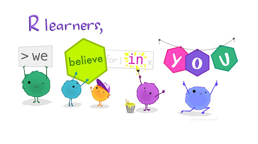

```{r setup, include=FALSE}
# packages
library(learnr)
library(tidyverse)
# hide non-exercise code chunks
knitr::opts_chunk$set(echo = FALSE)
```

## Introduction

This is RStat2101, the R {width="0.15in"} laboratory materials for the course STAT2101: Introduction to Statistics. R is an open-source statistical programming language for data analysis and data science. RStat2101 introduces the fundamentals of statistical analysis required to drive value from data. Here, you will learn how to explore data numerically and graphically using descriptive and basic inferential statistics. You will also learn how to find probabilities of the common distributions: Normal and Binomial.

If this is the first time you hear about R, the following short video created by R Consortium provides an overview about the program, its applications and what is used for.

<center>
<iframe width="560" height="315" src="https://www.youtube.com/embed/XcBLEVknqvY" title="YouTube video player" frameborder="0" allow="accelerometer; autoplay; clipboard-write; encrypted-media; gyroscope; picture-in-picture" allowfullscreen>
</iframe>
</center>

In Rtat2101, you are going to use a user-friendly R interface called RStudio {width="0.35in"}. It is an integrated development environment (IDE) for working with R. It is easy to write scripts and has practical features for data analysis and visualization. 

<!--The course is offered by the department of Statistics at <a href="https://www.squ.edu.om">Sultan Qaboos university</a>-->

This could be the first time you , but do not worry! Here, we will walk you through each of the steps required to begin using R.

{style="width: 800px; heiht: 300px;  "}


### Exercise

*Here's a simple exercise with an empty code chunk provided for entering the answer.*

Write the R code required to add two plus two:

```{r two-plus-two, exercise=TRUE}

```

### Exercise with Code

*Here's an exercise with some prepopulated code as well as `exercise.lines = 5` to provide a bit more initial room to work.*

Now write a function that adds any two numbers and then call it:

```{r add-function, exercise=TRUE, exercise.lines = 5}
add <- function() {
  
}
```

## Summary Statistics

### Exercise with Hint

*Here's an exercise where the chunk is pre-evaulated via the `exercise.eval` option (so the user can see the default output we'd like them to customize). We also add a "hint" to the correct solution via the chunk immediate below labeled `print-limit-hint`.*

Modify the following code to limit the number of rows printed to 5:

```{r print-limit, exercise=TRUE, exercise.eval=TRUE}
mtcars
```

```{r print-limit-hint}
head(mtcars)
```

### Quiz

*You can include any number of single or multiple choice questions as a quiz. Use the `question` function to define a question and the `quiz` function for grouping multiple questions together.*

Some questions to verify that you understand the purposes of various base and recommended R packages:

```{r quiz}
quiz(
  question("Which package contains functions for installing other R packages?",
    answer("base"),
    answer("tools"),
    answer("utils", correct = TRUE),
    answer("codetools")
  ),
  question("Which of the R packages listed below are used to create plots?",
    answer("lattice", correct = TRUE),
    answer("tools"),
    answer("stats"),
    answer("grid", correct = TRUE)
  )
)
```
## Data Visualization

## Basic Probability

/*## Confidence Intervals & Hypothesis Tests*/

/*## Correlation and Regression*/


