```{r echo=FALSE, message=FALSE, warning=FALSE}
library(knitr)    # For knitting document and include_graphics function
library(ggplot2)  # For plotting
library(png)      # For grabbing the dimensions of png files
```


For easily coding by R programming language you will need two main programs:

1. R {width=0.15in}.
2. RStudio {width=0.3in}.

The two programs are both free and available in the internet. First, you will need to download the R program and install it. Then, download the Rstudio and install it.
Here, we will explain how to download and install the two programs in details.

## \color{blue} Download and install R program?

1. First go to the [CRAN page](https://cran.r-project.org/).
2. Press on the link that has the same as your computer operating system (OS). See the picture bellow.

```{r echo=FALSE, out.width = "100%", message=FALSE, warning=FALSE, paged.print=FALSE}
# All defaults
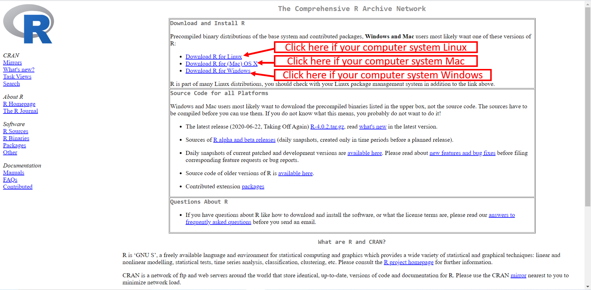
```

\newpage

For Mac, the next step is to click on the first option **.pkg** file, which includes the most recent release version of R. This installation guide is for R 4.0.2 (22-6-2020) as shown in the picture bellow.
\vspace{0.3cm}
```{r echo=FALSE, out.width = "100%", message=FALSE, warning=FALSE, paged.print=FALSE}
# All defaults
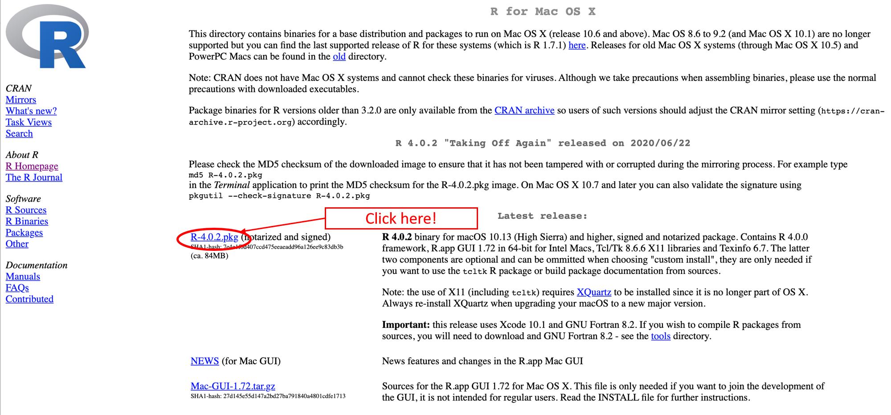
```

\vspace{0.3cm}
Then, the **R** program will be downloaded. Once finish the download, click on it and select **Open**. Then, follow the instructions in the pictures bellow.
\vspace{0.3cm}
```{r echo=FALSE, out.width = "100%", message=FALSE, warning=FALSE, paged.print=FALSE}
# All defaults
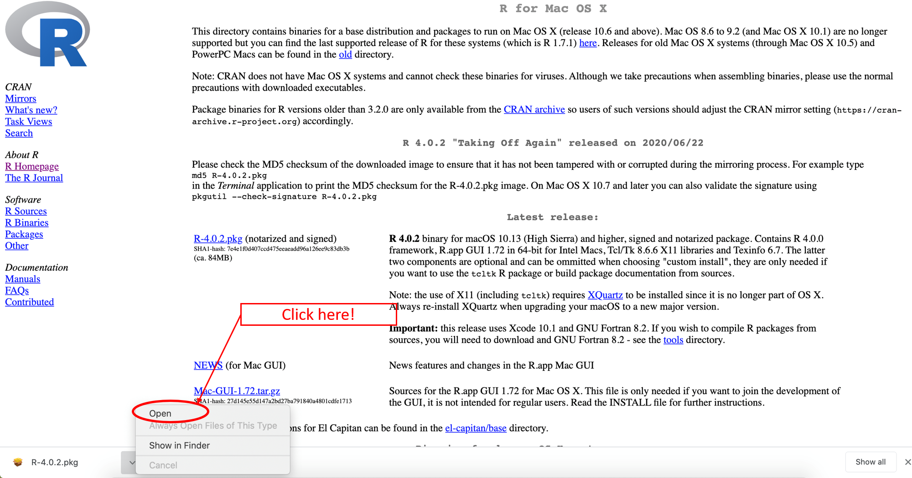
```


```{r echo=FALSE, out.width = "100%", message=FALSE, warning=FALSE, paged.print=FALSE}
# All defaults
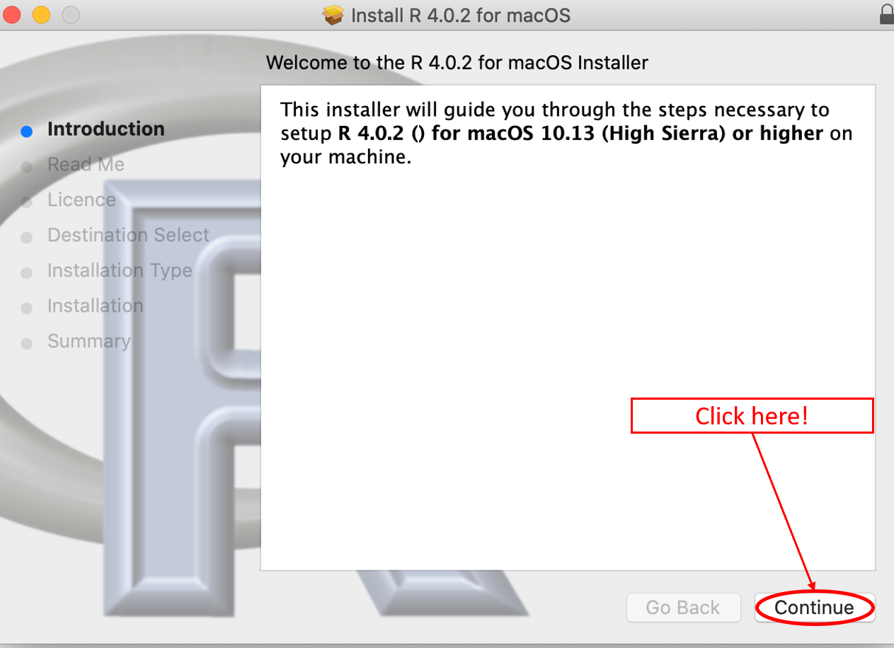
```


```{r echo=FALSE, out.width = "100%", message=FALSE, warning=FALSE, paged.print=FALSE}
# All defaults
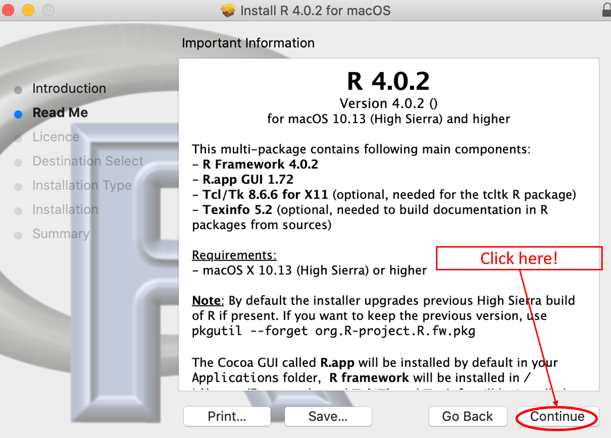
```

```{r echo=FALSE, out.width = "100%", message=FALSE, warning=FALSE, paged.print=FALSE}
# All defaults
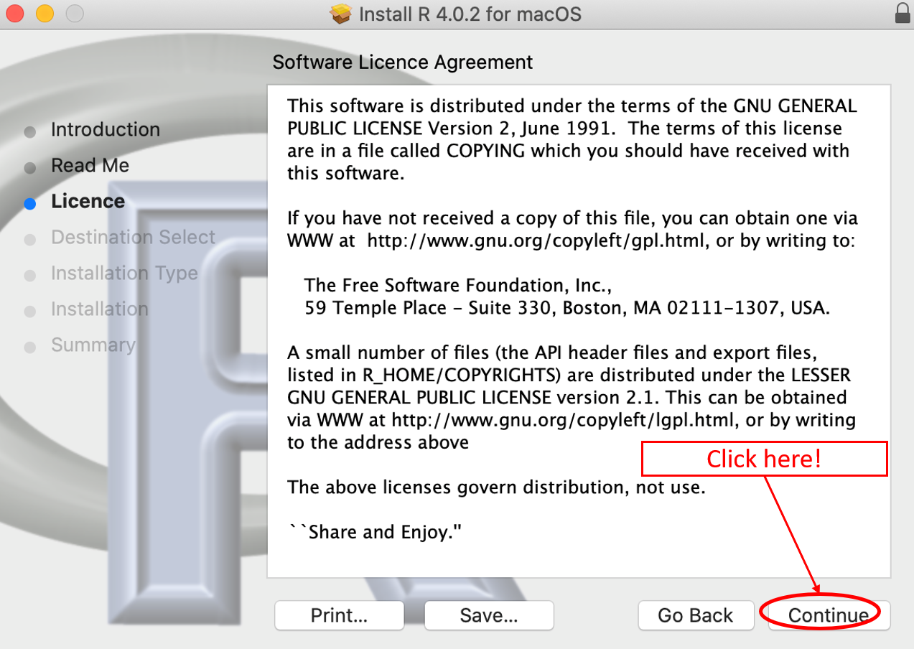
```

```{r echo=FALSE, out.width = "100%", message=FALSE, warning=FALSE, paged.print=FALSE}
# All defaults
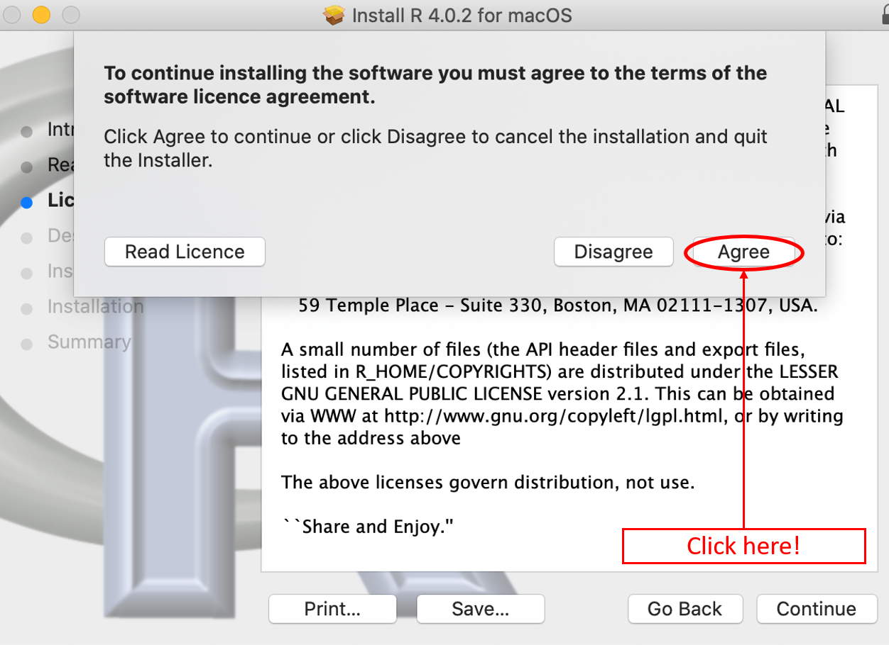
```


```{r echo=FALSE, out.width = "100%", message=FALSE, warning=FALSE, paged.print=FALSE}
# All defaults
include_graphics("R10.png")
```

```{r echo=FALSE, out.width = "100%", message=FALSE, warning=FALSE, paged.print=FALSE}
# All defaults
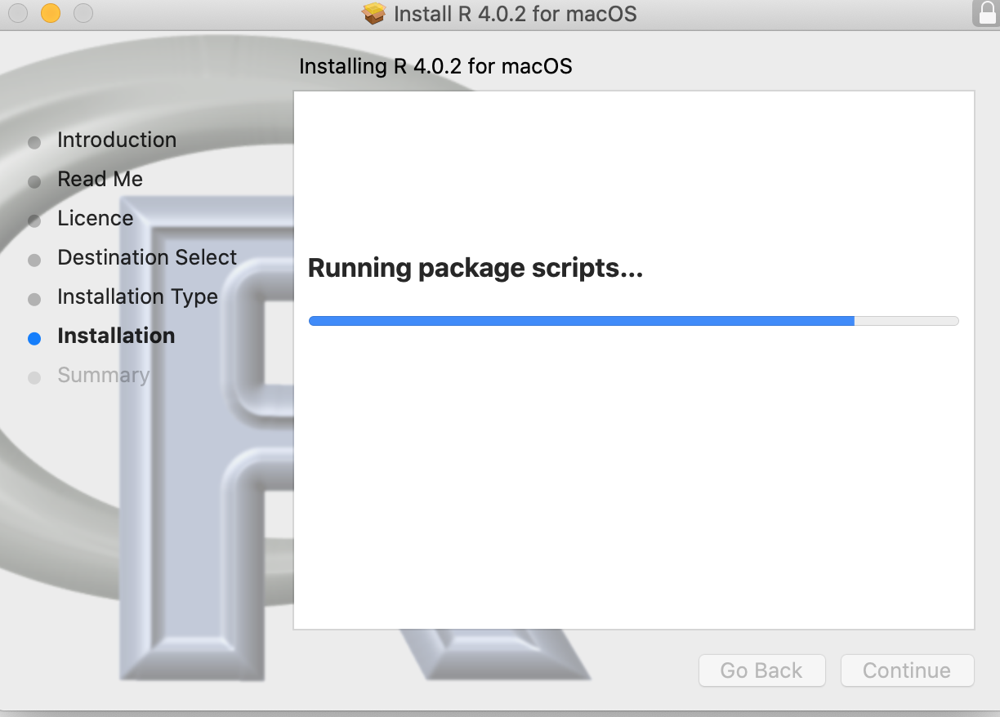
```

```{r echo=FALSE, out.width = "100%", message=FALSE, warning=FALSE, paged.print=FALSE}
# All defaults
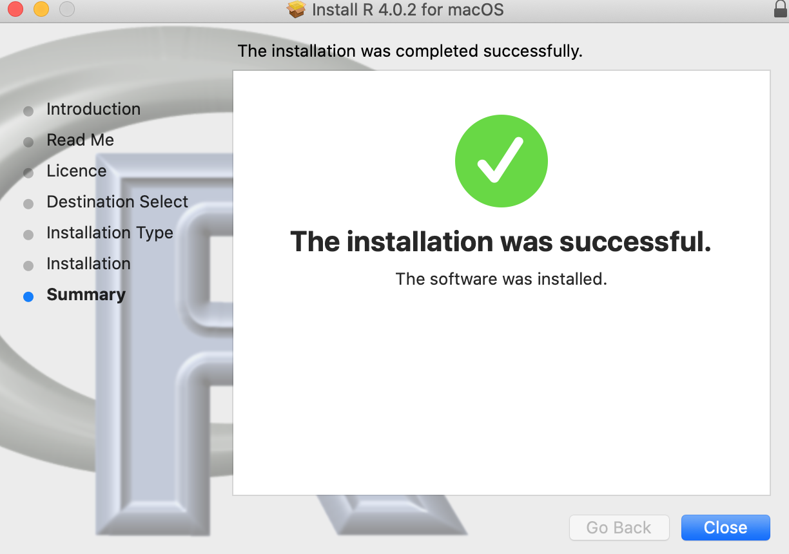
```

Now, the **R** program is on your computer.

\newpage

## \color{blue} Download and install RStudio program?
This installation guide is for Rstudio version 1.3.1073.

1. First go to the [RStudio page](https://rstudio.com/products/rstudio/download/). This page views the most recent version of Rstudio and the old versions as well.This page views the most recent version of Rstudio and the old too.
2. Click on the link for downloading the program. See the picture bellow.

```{r echo=FALSE, out.width = "100%", message=FALSE, warning=FALSE, paged.print=FALSE}
# All defaults
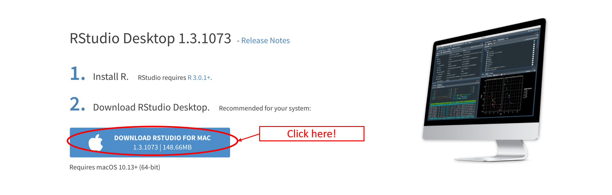
```

After finishing the download, go to the file and follow the following instructions as shown in the pictures bellow.
```{r echo=FALSE, out.width = "100%", message=FALSE, warning=FALSE, paged.print=FALSE}
# All defaults
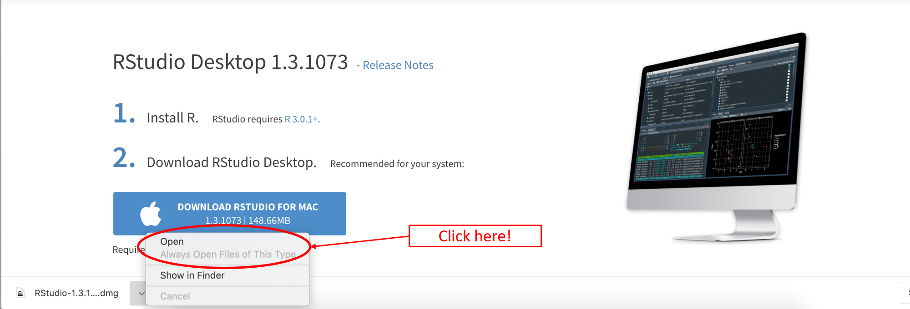
```

Then,
```{r echo=FALSE, out.width = "100%", message=FALSE, warning=FALSE, paged.print=FALSE}
# All defaults
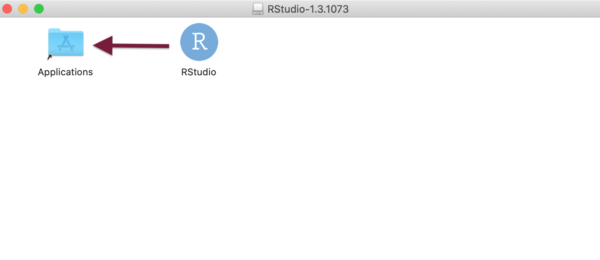
```

Now, you have the RStudio program in your computer. \large Congratulations!!
\newpage
This is the RStudio program layout!

```{r echo=FALSE, out.width = "90%", message=FALSE, warning=FALSE, paged.print=FALSE}
# All defaults
include_graphics("step21windows.png")
```

