```{r echo=FALSE, message=FALSE, warning=FALSE}
#setwd("~/Dropbox/R programing/Introduction to R/Install R")
library(knitr)    # For knitting document and include_graphics function
library(ggplot2)  # For plotting
library(png)      # For grabbing the dimensions of png files
```

For easily coding by R programming language you will need two main programs:

1.  R {width="0.15in"}.
2.  RStudio {width="0.3in"}.

The two programs are both free and available in the internet.
First, you will need to download the R program and install it.
Then, download the Rstudio and install it.
Here, we will explain how to download and install the two programs in details.

## \color{blue} Download and install R program

1.  First go to the [CRAN page](https://cran.r-project.org/).
2.  Click on Download R for Windows, see the picture bellow. \vspace{1cm}

```{r echo=FALSE, out.width = "100%", message=FALSE, warning=FALSE, paged.print=FALSE}
# All defaults
include_graphics("step1.png")
```

\newpage

The next step is to click on the **install R for the first time** as shown in the picture bellow.
\vspace{0.5cm}

```{r echo=FALSE, out.width = "100%", message=FALSE, warning=FALSE, paged.print=FALSE}
# All defaults
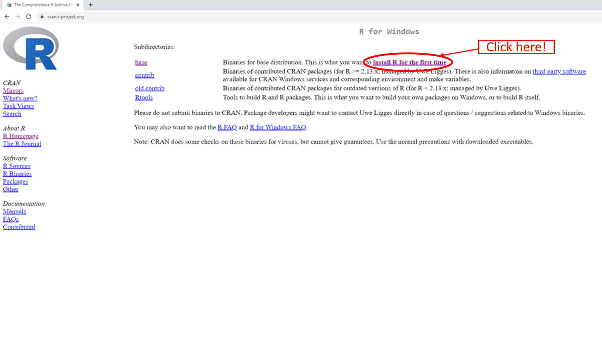
```

\vspace{0.5cm}

Then, click on the first option **Download R for Windows**, which includes the most recent release version of R.
This installation guide is for R 4.0.2 (22-6-2020) as shown in the picture bellow.
\vspace{0.5cm}

```{r echo=FALSE, out.width = "100%", message=FALSE, warning=FALSE, paged.print=FALSE}
# All defaults
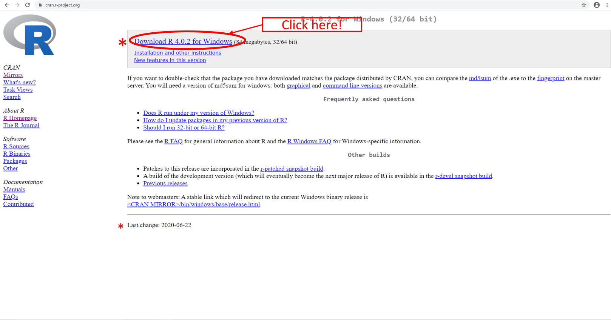
```

\vspace{1cm}

Then, the **R** program will be downloaded.
Once finish the download, you go to the file that you have downloaded and click on it and select **Open**.
Then, follow the instructions in the pictures bellow.

\vspace{1cm}

```{r echo=FALSE, out.width = "100%", message=FALSE, warning=FALSE, paged.print=FALSE}
# All defaults
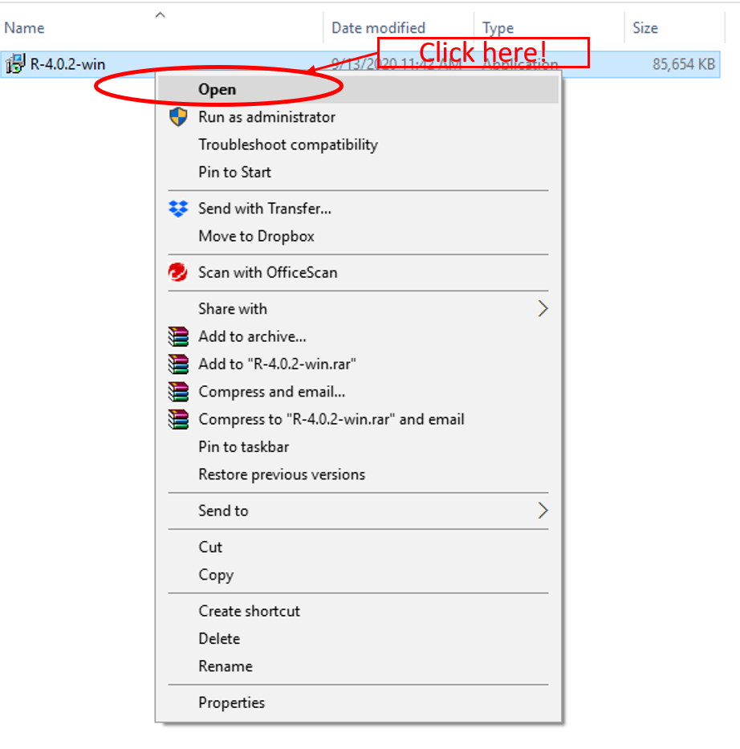
```

\vspace{1cm}

```{r echo=FALSE, out.width = "100%", message=FALSE, warning=FALSE, paged.print=FALSE}
# All defaults
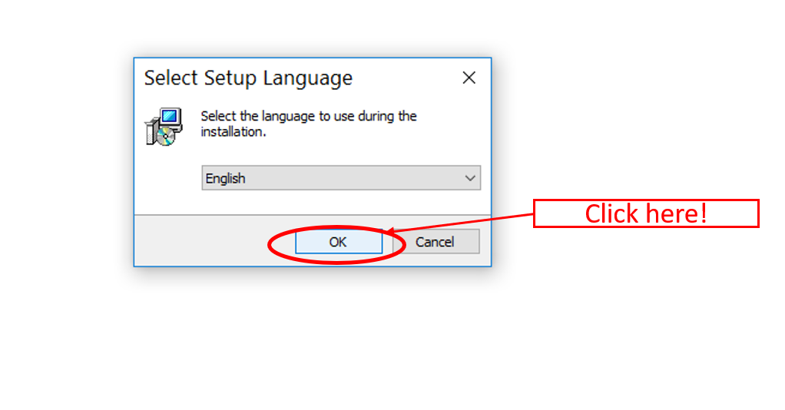
```

\vspace{1cm}

```{r echo=FALSE, out.width = "100%", message=FALSE, warning=FALSE, paged.print=FALSE}
# All defaults
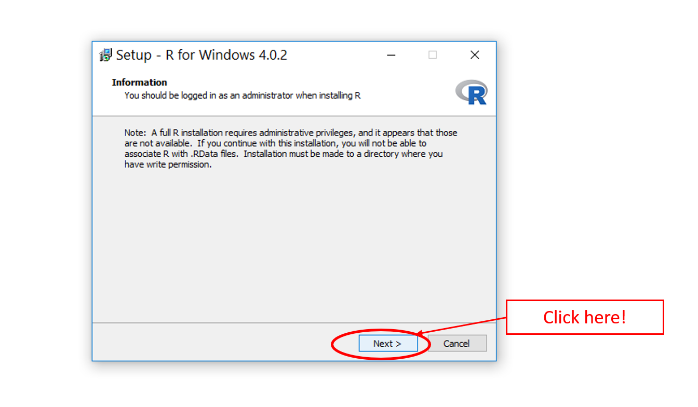
```

\vspace{1cm}

```{r echo=FALSE, out.width = "100%", message=FALSE, warning=FALSE, paged.print=FALSE}
# All defaults
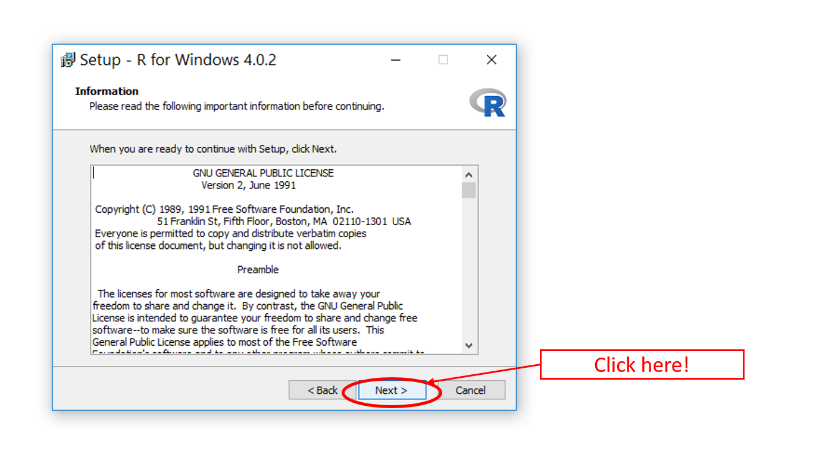
```

\vspace{1cm}

```{r echo=FALSE, out.width = "100%", message=FALSE, warning=FALSE, paged.print=FALSE}
# All defaults
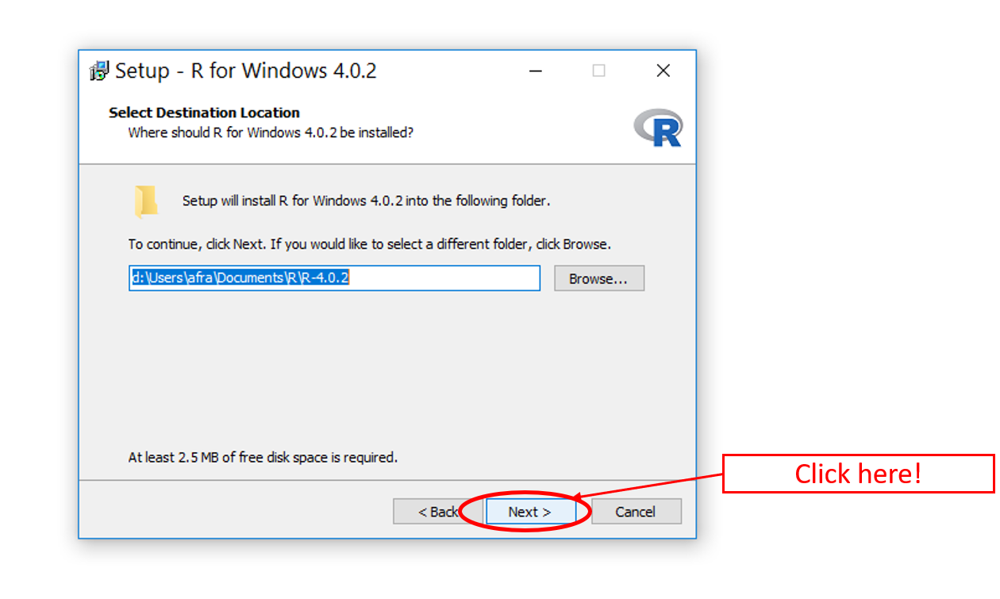
```

\vspace{1cm}

```{r echo=FALSE, out.width = "100%", message=FALSE, warning=FALSE, paged.print=FALSE}
# All defaults
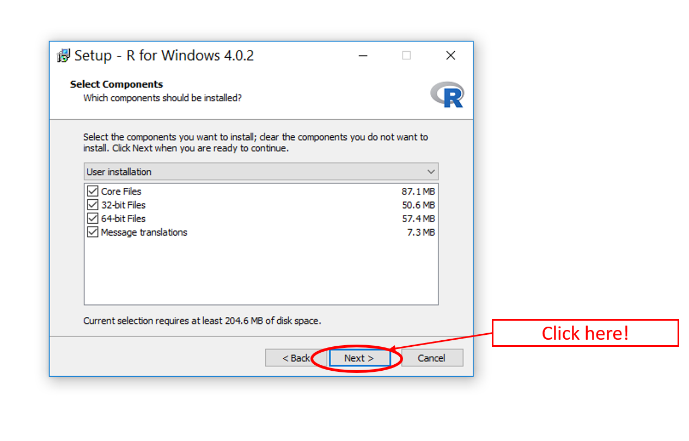
```

\vspace{1cm}

```{r echo=FALSE, out.width = "100%", message=FALSE, warning=FALSE, paged.print=FALSE}
# All defaults
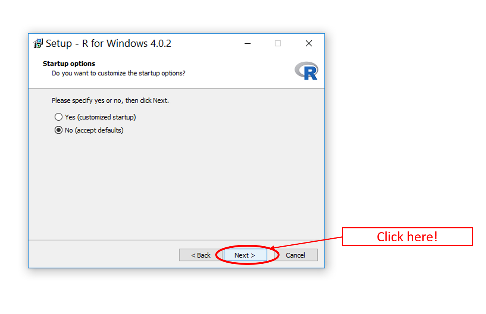
```

\vspace{1cm}

```{r echo=FALSE, out.width = "100%", message=FALSE, warning=FALSE, paged.print=FALSE}
# All defaults
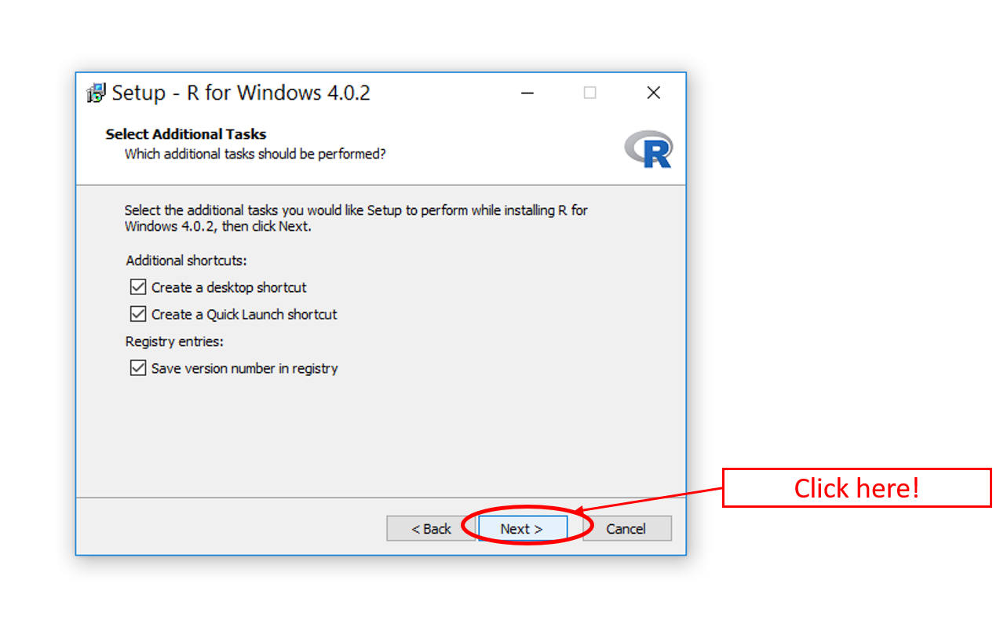
```

\vspace{1cm}

```{r echo=FALSE, out.width = "100%", message=FALSE, warning=FALSE, paged.print=FALSE}
# All defaults
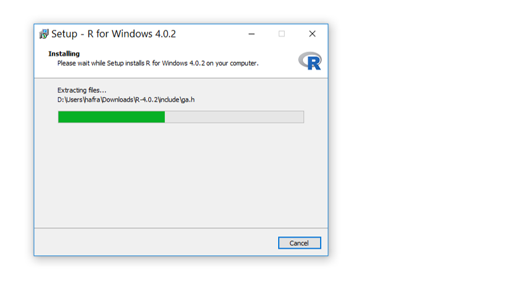
```

\vspace{1cm}

Now, the **R** program is in your computer.

\newpage

## \color{blue} Download and install RStudio program

This installation guide is for Rstudio version 1.3.1073.

1.  First go to the [RStudio page](https://rstudio.com/products/rstudio/download/). This page views the most recent version of Rstudio and the old versions as well.
2.  Click on the link for downloading the program. See the picture bellow. \vspace{1cm}

```{r echo=FALSE, out.width = "100%", message=FALSE, warning=FALSE, paged.print=FALSE}
# All defaults
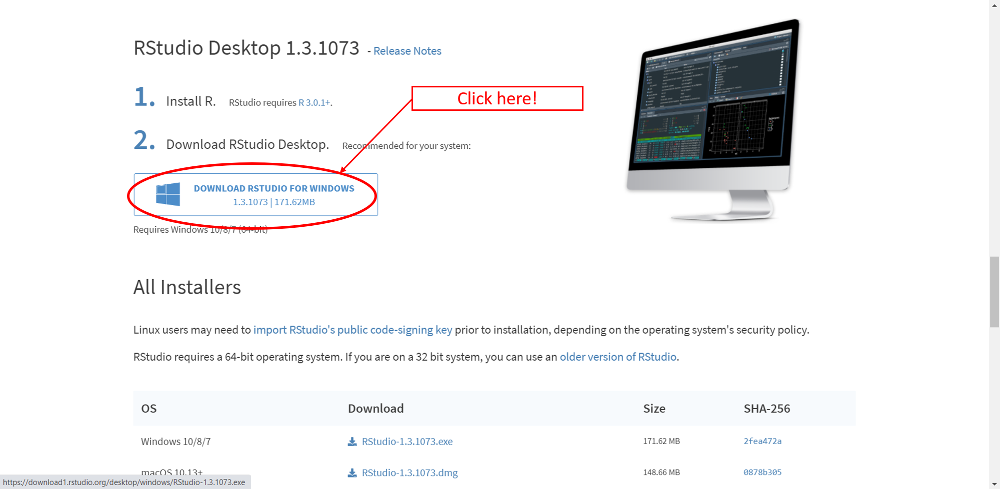
```

\newpage

After finishing the download, go to the file and follow the following instructions as shown in the pictures bellow.
\vspace{0.5cm}

```{r echo=FALSE, out.width = "100%", message=FALSE, warning=FALSE, paged.print=FALSE}
# All defaults
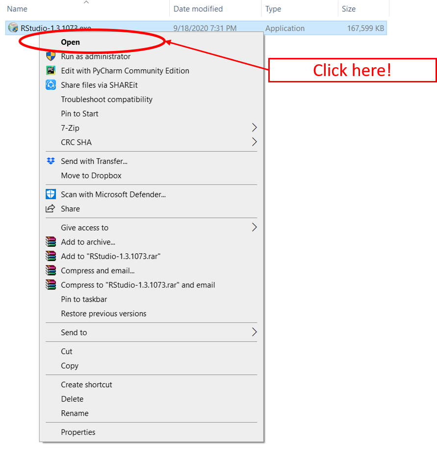
```

\vspace{1cm}

```{r echo=FALSE, out.width = "100%", message=FALSE, warning=FALSE, paged.print=FALSE}
# All defaults
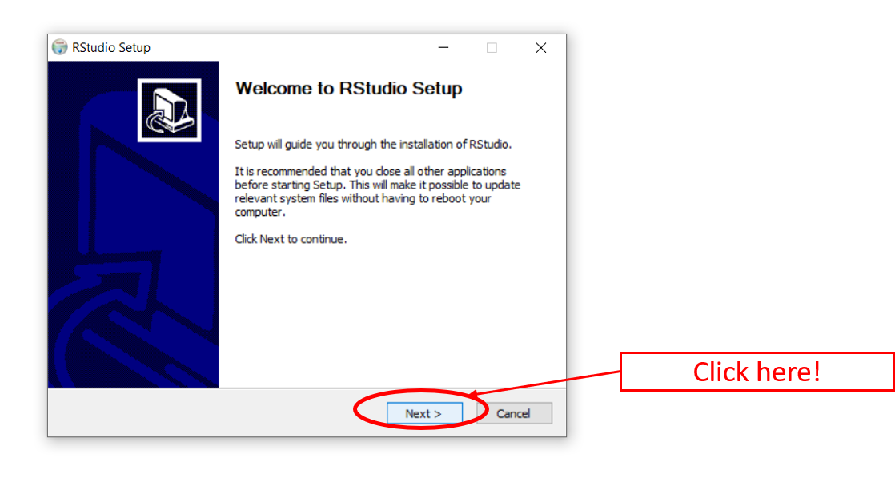
```

\vspace{1cm}

```{r echo=FALSE, out.width = "100%", message=FALSE, warning=FALSE, paged.print=FALSE}
# All defaults
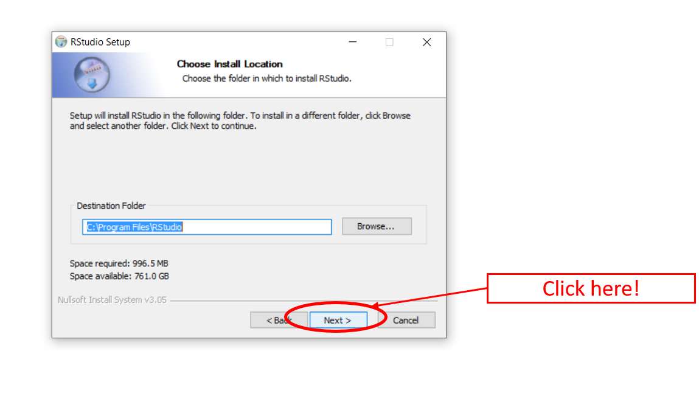
```

\vspace{1cm}

```{r echo=FALSE, out.width = "100%", message=FALSE, warning=FALSE, paged.print=FALSE}
# All defaults
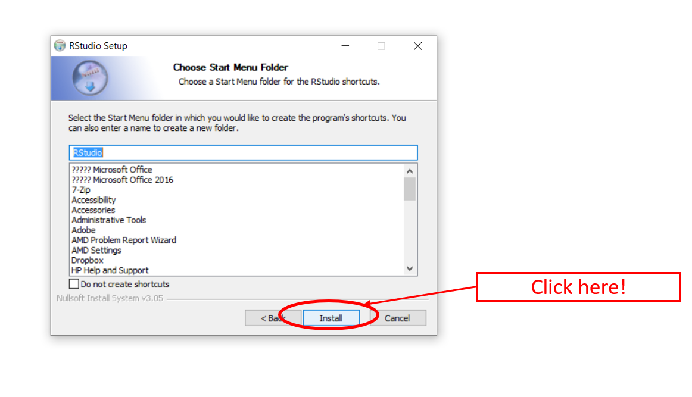
```

\vspace{1cm}

```{r echo=FALSE, out.width = "100%", message=FALSE, warning=FALSE, paged.print=FALSE}
# All defaults
include_graphics("step18windows.png")
```

\vspace{1cm}

```{r echo=FALSE, out.width = "100%", message=FALSE, warning=FALSE, paged.print=FALSE}
# All defaults
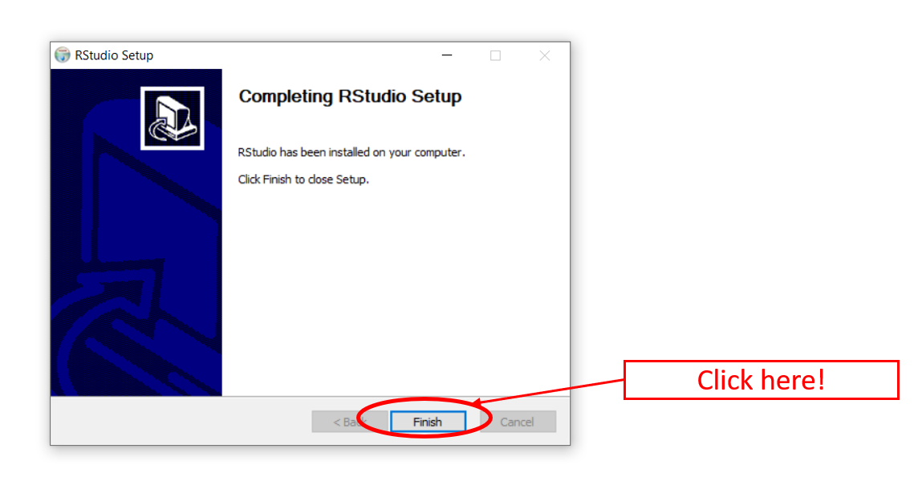
```

\vspace{1cm}

Now, you have the RStudio program in your computer.
\large Congratulations!!
\newpage To open the program do the following: \vspace{1cm}

```{r echo=FALSE, out.width = "90%", message=FALSE, warning=FALSE, paged.print=FALSE}
# All defaults
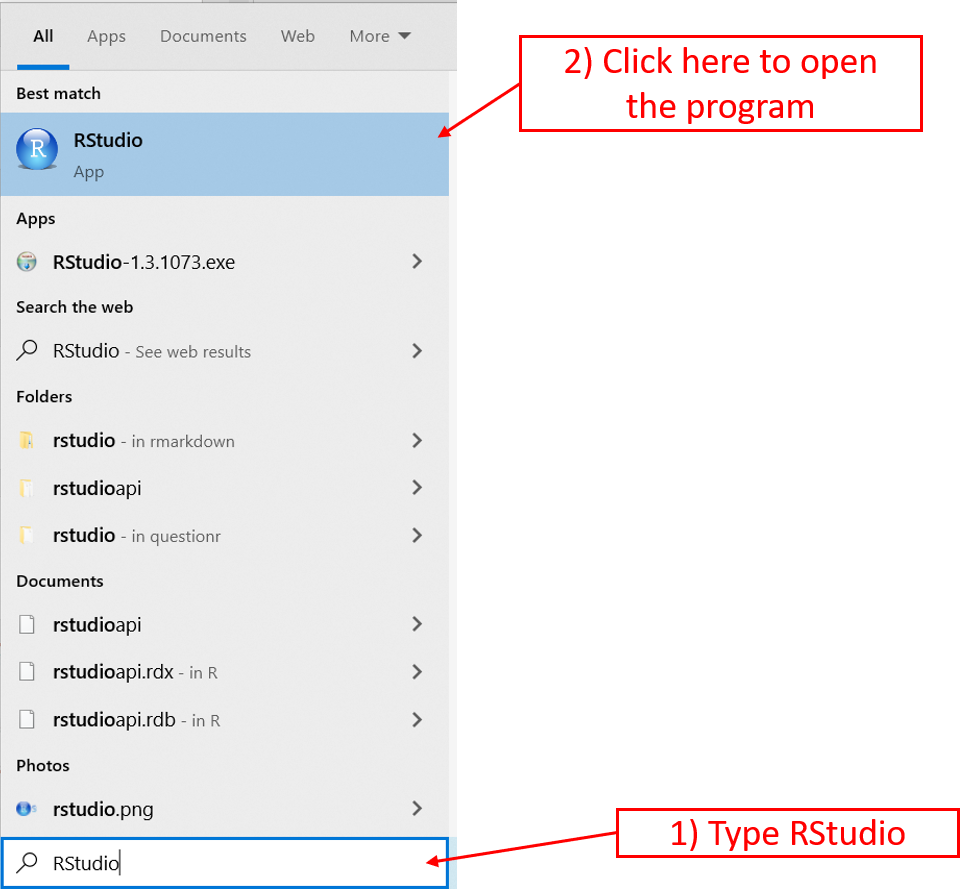
```

\newpage

This is the RStudio program layout!
\vspace{1cm}

```{r echo=FALSE, out.width = "90%", message=FALSE, warning=FALSE, paged.print=FALSE}
# All defaults
include_graphics("step21windows.png")
```
