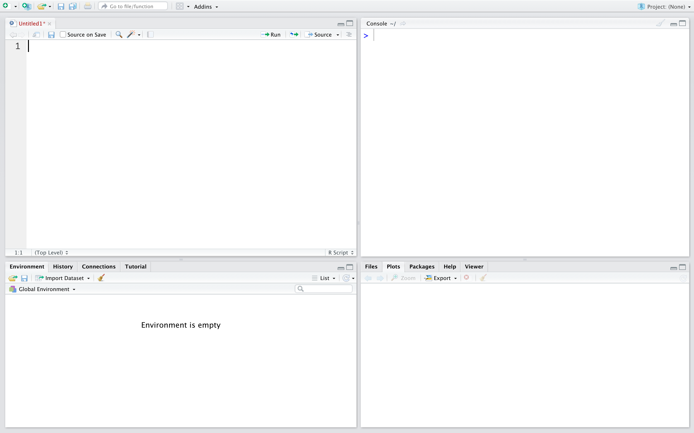
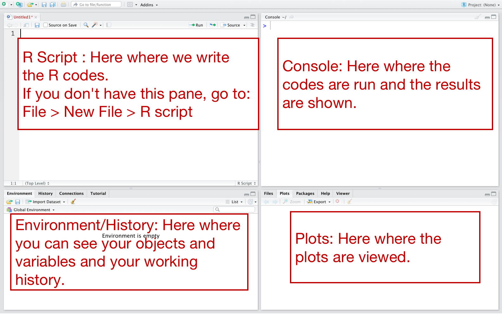
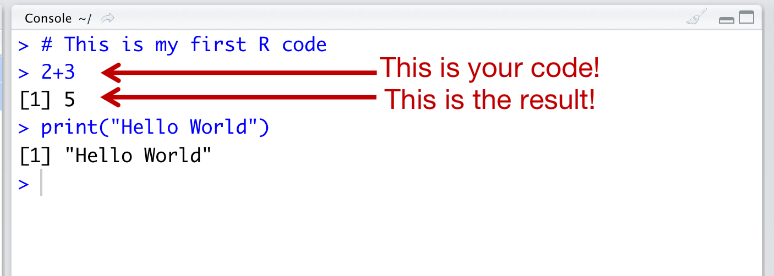
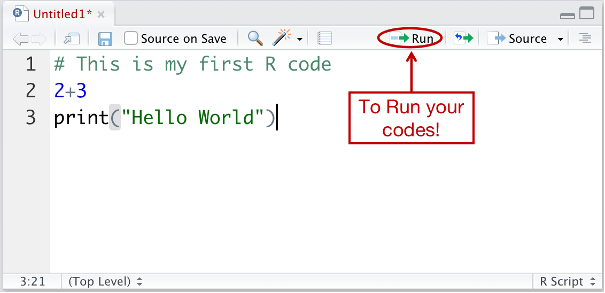
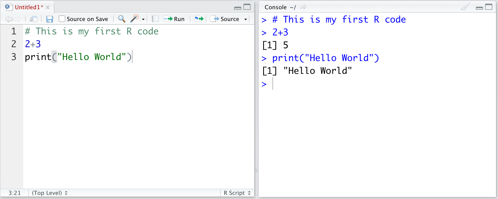

```{r echo=FALSE, message=FALSE, warning=FALSE}
library(knitr)    # For knitting document and include_graphics function
library(ggplot2)  # For plotting
library(png)      # For grabbing the dimensions of png files
```

# <span style="color:royalblue">How RStudio Looks Like?</span>

RStudio is a program allows you to write R codes for statistical computing and graphics. It makes the coding easier and provides many tools. When you open the RStudio, the program will look like the figure shown below.
```{r echo=FALSE, out.width = "100%", message=FALSE, warning=FALSE, paged.print=FALSE, fig.cap = "RStudio Interface"}
# All defaults

```

You can see that the program has several panes. Each pane does different tasks and gives specific information. Here we focus on the four standard panes: 
-   R script.
-   Console.
-   Files/Plots/Packages/Help/Viewer.
-   Environment/History/Tutorials

See Figure 2.

```{r echo=FALSE, out.width = "100%", message=FALSE, warning=FALSE, paged.print=FALSE, fig.cap = "Important Panes"}
# All defaults

```

\newpage

**Console**: The console pane can run the codes or commands that you enter. Then, it shows the results of your codes. If the code has error, it describes the code error type. The console pane may located in the right or the left side of the program. See Figure 3.

```{r echo=FALSE, out.width = "100%", message=FALSE, warning=FALSE, paged.print=FALSE, fig.cap = "Console"}
# All defaults

```

**R script**: The R script is the pane you can record and save your codes. The codes can be run directly by the **console**, so you don't need to write the codes again in the **console**. To run the code, you will have to click on the **Run** button, which is on the right hand side of the R script pane. See Figure 4.

```{r echo=FALSE, out.width = "100%", message=FALSE, warning=FALSE, paged.print=FALSE, fig.cap = "R script"}
# All defaults

```

\newpage

Figure 5 shows that you can use the R script pane and the console pane together. So, you can put the codes in the R script, then you run the codes. The codes and the results will appear in the console pane.

```{r echo=FALSE, out.width = "100%", message=FALSE, warning=FALSE, paged.print=FALSE, fig.cap = "R script and Console"}
# All defaults

```

Using the R script, you can save your codes and use them anytime. To save the R script, you click on **File\> Save**, then give your file a name. Later, if you want to use it, you should go to **File\> Open File**.
